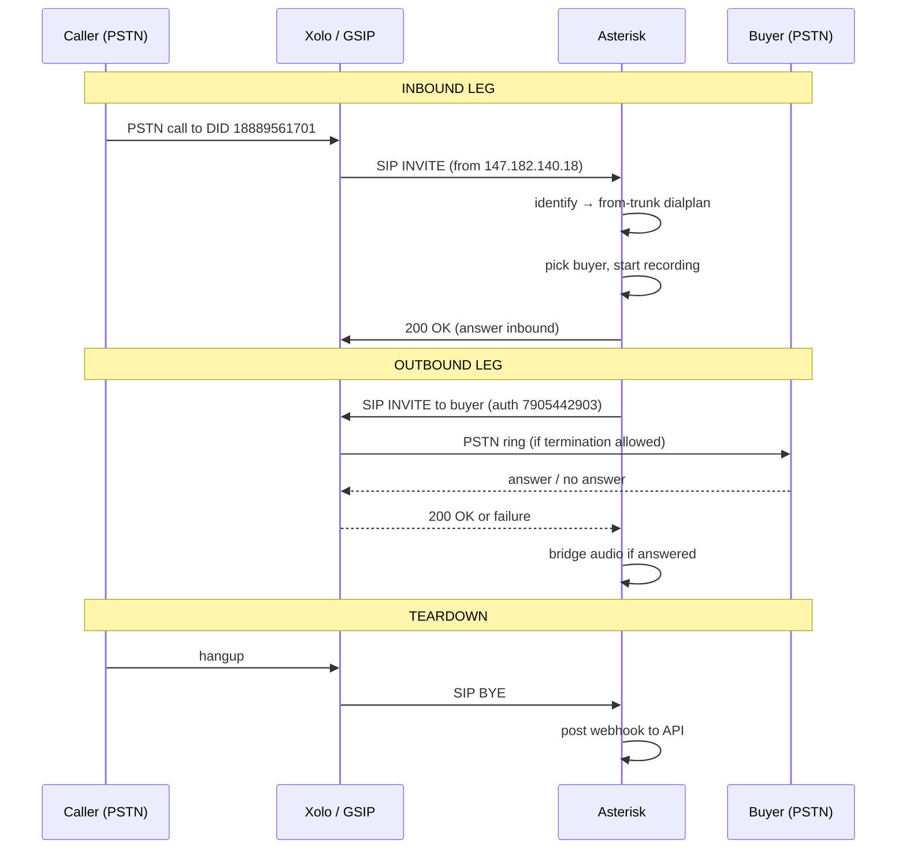

# Asterisk & Call Forwarding — How Tellimon Works

A guide for understanding **why** we use Asterisk, **what** call forwarding does, and **how** the pieces connect. Written for both non-technical readers and developers.

---

## Your scenario (the simple version)

**What you want:**

> I have a DID. When someone calls it, ring my **buyer number**. That's it.

Example:

```
Caller dials:     1-888-956-1701   (your DID)
                         ↓
Should ring:      1-813-432-6122   (buyer number)
```

That **is** call forwarding. Tellimon + Asterisk exist to do exactly this — automatically, every time, with logging.

### Why it sounds more complicated than "forward DID → buyer"

On paper it's one step. On the phone network it's **two hops**:

| Step | Plain English | Technical name |
|------|---------------|----------------|
| 1 | Call arrives on your DID | **Inbound** — Xolo → your server |
| 2 | Server rings the buyer | **Outbound** — your server → buyer's phone |

You only configure **one forward rule** in the panel (DID → buyer). Asterisk and Xolo handle the two hops behind the scenes.

```
YOUR VIEW (simple):

  Caller ──► DID 18889561701 ──► Buyer +1-813-432-6122


WHAT ACTUALLY HAPPENS (two hops):

  Caller ──► DID ──► Xolo ──► Asterisk (91.108.104.221) ──► Xolo ──► Buyer
              │                    │                              │
              └──── inbound ───────┘                              │
                                   └──── outbound ────────────────┘
```

### What you set in Xolo vs Tellimon

| Where | What you set | Your setup |
|-------|--------------|------------|
| **Xolo panel** | DID destination | Server IP `91.108.104.221` (not SIP device) |
| **Tellimon panel** | DID + buyer number | DID `18889561701` → buyer `+1-813-432-6122` |

Xolo delivers the call **to your server**. Tellimon tells the server **which buyer to ring**.

### Minimum setup for DID → one buyer

If you only have one DID and one buyer, you need:

1. **Xolo:** DID points to `91.108.104.221:5060`
2. **Tellimon:** Add buyer number, assign DID to that buyer (or campaign)
3. **Asterisk:** Running on server, connected to Xolo
4. **Xolo:** Allow outbound dialing to buyer's real phone (PSTN) — **this is what's failing now**

Campaigns, sticky routing, blocked lists, etc. are **extras**. Core flow is still: **DID in → buyer out**.

---

## Part 1: Simple explanation (no jargon)

### What problem are we solving?

You buy phone numbers (DIDs) like `1-888-956-1701`. When someone calls that number, you want the call to **automatically ring another phone** — a “buyer” — without anyone manually answering the DID first.

That is **call forwarding**, but at scale:

- Many DIDs
- Many buyers
- Rules like “send repeat callers to the same buyer” (sticky routing)
- Block bad numbers
- Record calls and show reports in a web panel

A phone carrier (XoloIP) can forward one number to one destination. **Tellimon** adds the brain on top: who gets the call, when, and logging everything.

### Why can’t the panel alone handle calls?

A website (React panel + Node API) **cannot receive or place phone calls**. Browsers and REST APIs don’t speak SIP/RTP — the protocols phones use.

You need a **telephony server** that:

1. Accepts incoming calls from the carrier
2. Decides where to send them (using your panel’s rules)
3. Dials the buyer’s phone
4. Bridges audio between caller and buyer
5. Records the call and reports back to your API

**Asterisk** is that server. It is open-source PBX software that runs on a VPS and handles real-time voice.

### The big picture

```
Caller dials your DID
       ↓
Phone carrier (XoloIP) receives it
       ↓
Carrier sends call to YOUR server IP (Asterisk)
       ↓
Asterisk asks Tellimon API: "Which buyer?"
       ↓
Asterisk dials the buyer through the carrier
       ↓
Caller talks to buyer (if answered)
       ↓
Call ends → Asterisk sends result to API → shows in panel
```

### What you manage in the panel vs what Asterisk does

| You set in the panel | Asterisk does at call time |
|----------------------|----------------------------|
| Buyer phone numbers | Dials the chosen buyer |
| DIDs and campaigns | Matches DID to campaign rules |
| Blocked contacts | Hangs up on blocked callers |
| Ring timeout, priority | Waits N seconds for answer |
| — | Records audio to `.wav` |
| — | Posts call status to API |

**Panel = configuration and reports. Asterisk = actual phone calls.**

---

## Part 2: Architecture (technical overview)

Tellimon is three layers:

```
┌─────────────────────────────────────────────────────────┐
│  Frontend (React)          hitechpbxworld.com           │
│  Login, Buyers, DIDs, Campaigns, Call Reports, etc.   │
└───────────────────────────┬─────────────────────────────┘
                            │ HTTPS / REST
┌───────────────────────────▼─────────────────────────────┐
│  Backend (Node.js + MongoDB)   api.hitechpbxworld.com   │
│  Auth, CRUD, routing logic, webhooks, live calls        │
└───────────────────────────┬─────────────────────────────┘
                            │ HTTP (sync + webhooks)
┌───────────────────────────▼─────────────────────────────┐
│  Asterisk VPS              91.108.104.221:5060            │
│  SIP/PJSIP, dialplan, recordings, routing scripts         │
└───────────────────────────┬─────────────────────────────┘
                            │ SIP (UDP 5060 + RTP)
┌───────────────────────────▼─────────────────────────────┐
│  Carrier (XoloIP / GSIP)   gate157.gsip.xoloip.com        │
│  DIDs, inbound to IP, outbound termination                │
└───────────────────────────────────────────────────────────┘
```

### Key servers and files

| Component | Location | Role |
|-----------|----------|------|
| Frontend | Vercel / `Tellimon/` | UI |
| Backend | VPS PM2 / `backend/` | API + MongoDB |
| Asterisk | `91.108.104.221` | Voice switching |
| PJSIP config | `/etc/asterisk/pjsip.d/xoloip.conf` | Xolo trunk + IP identify |
| Dialplan | `/etc/asterisk/extensions.d/tellimon.conf` | Per-call logic |
| Sync config | `/etc/tellimon/config` | API URL, credentials |
| Routing cache | `/etc/tellimon/routing.json` | Buyers/DIDs synced from API |
| Recordings | `/var/www/recordings/*.wav` | Call audio |
| Webhook log | `/var/log/tellimon-webhook.log` | Post-call debug |

Repo scripts (deploy from `Tellimon/scripts/`):

- `vps-tellimon-setup.sh` — dialplan, sync, nginx for recordings
- `xoloip.conf` — PJSIP template for Xolo
- `tellimon-pick-buyer.py` — resolve buyer at call time
- `tellimon-post-call.sh` — send CDR to API after hangup
- `tellimon-sync.sh` — pull routing snapshot from API

---

## Part 3: Why Asterisk specifically?

### What Asterisk gives you

1. **SIP endpoint** — listens on UDP 5060 for inbound calls from Xolo
2. **Dialplan** — programmable call flow (if blocked → hangup, else dial buyer)
3. **PJSIP** — modern SIP stack (registration, auth, IP-based identify)
4. **MixMonitor** — record both sides of the call
5. **CDR** — call detail records (duration, disposition)
6. **Script integration** — shell/Python hooks during a live call

### Alternatives (and why we didn’t use them for the core)

| Option | Limitation for Tellimon |
|--------|-------------------------|
| Carrier-only forward (Xolo panel) | No custom routing, no API, no multi-buyer campaigns |
| Twilio Functions only | Possible, but different cost model; we chose self-hosted Asterisk + Xolo |
| FreeSWITCH | Similar to Asterisk; Asterisk has wider docs/community for PBX dialplan |
| WebRTC in browser | Callers don’t use a browser; they use regular phones |

Asterisk is the industry-standard choice when you need **your own routing logic** between carrier and destination.

---

## Part 4: Call flow step by step (technical)

### Inbound path (DID → server IP)

Recommended setup (avoids double billing / SIP-device loops):

1. In XoloIP **IP Settings**: map `91.108.104.221`, prefix `1`, Active
2. Per DID: destination = **server IP** `91.108.104.221:5060`, **not** SIP device
3. Xolo gateway IP `147.182.140.18` hits Asterisk
4. PJSIP `[xolo-identify]` matches that IP → endpoint `xolo-endpoint` → context `from-trunk`

Inbound works even when SIP registration is flaky, as long as IP routing is correct.

### Dialplan (`from-trunk` context)

When a call arrives, Asterisk runs roughly:

```
1. NoOp — log caller and DID
2. Set CALLER, DID from SIP headers
3. Gosub tellimon-check-blocked — grep /etc/tellimon/blocked.list
4. Run tellimon-pick-buyer.py DID CALLER
      → returns: buyerNumber|buyerId|ringTimeout|campaignId
5. MixMonitor — start recording to /var/www/recordings/{UNIQUEID}.wav
6. Set CALLERID — pass real caller ID on outbound leg
7. Dial PJSIP/${BUYER}@xolo-endpoint,${RING_TIMEOUT}
8. Map DIALSTATUS → answered | busy | no-answer | missed
9. Gosub tellimon-post-cdr — POST to API webhook
10. Hangup
```

### Buyer selection (`tellimon-pick-buyer.py`)

Two modes:

1. **Live API** — `POST /api/routing/resolve` with `userId`, `did`, `caller`
2. **Cached snapshot** — reads `/etc/tellimon/routing.json` (synced every few seconds)

Routing rules (in `backend/src/utils/routing.js`):

- DID may have a fixed `buyerId`
- Campaign links DIDs to a pool of buyers
- Strategies: round-robin, sticky (same caller → same buyer), priority, daily caps
- Skips buyers at concurrent call limit

### Outbound path (Asterisk → buyer)

```
Dial(PJSIP/18135551234@xolo-endpoint, 60)
```

Asterisk sends SIP INVITE to `gate157.gsip.xoloip.com` with:

- Auth: SIP user `7905442903`
- Request-URI: buyer number
- Caller ID: original caller (via `send_pai`, `trust_id_outbound`)

Xolo must **terminate** the call to the PSTN (buyer’s real mobile). That is a **carrier account feature**, not something Asterisk can fix alone.

### Post-call webhook

`tellimon-post-call.sh` → `POST /api/calls/webhook` with:

- `caller`, `did`, `buyerNumber`, `buyerId`, `campaignId`
- `status`, `duration`, `billsec`
- `uniqueId`, recording URL
- Header: `x-asterisk-secret` (shared secret)

Backend creates/updates `CallRecord` in MongoDB → visible in Call Reports.

### Sync loop

`tellimon-sync.sh` (cron or daemon every ~3s):

- `GET /api/routing/snapshot` → writes `routing.json`
- `GET /api/buyers`, `/api/blocked-contacts`, `/api/dids`
- Keeps Asterisk routing in sync with panel changes without restarting Asterisk

---

## Part 5: SIP / networking basics

| Term | Meaning |
|------|---------|
| **SIP** | Signaling — sets up, answers, hangs up calls (UDP 5060) |
| **RTP** | Audio media stream (UDP high ports) |
| **DID** | Phone number you own (Direct Inward Dial) |
| **Trunk** | Connection between your server and carrier |
| **PJSIP** | Asterisk’s SIP channel driver |
| **Registration** | Asterisk logs into carrier as a SIP user (for outbound) |
| **IP identify** | Match inbound calls by source IP (no registration needed) |
| **Dialplan** | Asterisk’s call routing script language |
| **CDR** | Call Detail Record — who called whom, how long, result |

### Ports on VPS `91.108.104.221`

| Port | Protocol | Purpose |
|------|----------|---------|
| 5060 | UDP | SIP signaling |
| 10000–20000 (typical) | UDP | RTP audio |
| 80 | HTTP | Recording file URLs |

Firewall must allow Xolo gateway IP and RTP range.

---

## Part 6: Inbound vs outbound — in your DID → buyer scenario

> **Remember:** You only think in terms of "DID forwards to buyer." Inbound/outbound are just the two network hops required to make that happen.

### 6.1 Your view vs what the network does

```
YOU CONFIGURE:     DID 18889561701  →  buyer +1-813-432-6122

NETWORK DOES:
  Hop 1 (inbound):  caller's phone  →  Xolo  →  Asterisk
  Hop 2 (outbound): Asterisk  →  Xolo  →  buyer's phone
```

| Leg | Plain English | Who pays / who moves the call |
|-----|---------------|-------------------------------|
| **Inbound** | "Someone called my DID — send it to my server" | Xolo receives PSTN call, SIP to `91.108.104.221` |
| **Outbound** | "Now ring the buyer number" | Asterisk asks Xolo to dial buyer's mobile |

Both hops must work for the buyer's phone to ring. Your inbound hop works. The outbound hop to real PSTN is blocked on Xolo's side right now.

### 6.2 Simple two-leg diagram

Every forwarded call has **two legs**:

```
LEG 1 — INBOUND          LEG 2 — OUTBOUND
(caller → you)           (you → buyer)

Caller                   Asterisk                   Buyer phone
   │                         │                           │
   │──── calls DID ─────────►│                           │
   │                         │──── dials buyer ─────────►│
   │◄─── audio bridge ──────►│◄──── audio bridge ───────►│
```

| Leg | Question it answers | Who starts it |
|-----|---------------------|---------------|
| **Inbound** | “A call arrived on our DID — accept it” | Xolo sends SIP to Asterisk |
| **Outbound** | “Connect this call to the buyer’s number” | Asterisk sends SIP to Xolo |

You configured **inbound** correctly (DID → server IP). **Outbound** is a separate permission on your Xolo account.

---

### 6.3 Inbound — technical deep dive

#### What “inbound” means here

Inbound = Xolo delivers a PSTN caller to your Asterisk box as a **SIP INVITE** on UDP `5060`.

The caller never talks to Asterisk directly. The path is:

```
PSTN caller → Xolo switch → SIP INVITE → 91.108.104.221:5060 → Asterisk
```

#### Two ways Xolo can send inbound (we use method B)

| Method | Xolo panel setting | How Asterisk accepts | Billing risk |
|--------|-------------------|----------------------|--------------|
| **A. SIP device** | DID → SIP user `7905442903` | Asterisk must be registered as that device | Can loop / double bill if device also registers |
| **B. IP auth** ✅ | DID → IP `91.108.104.221:5060` | Match source IP `147.182.140.18` | Cleaner — call lands on server directly |

We use **IP auth (B)**. Registration can even be down and inbound still works, as long as IP routing is correct.

#### Inbound SIP message flow

```
Xolo (147.182.140.18)                    Asterisk (91.108.104.221)
        │                                         │
        │  INVITE sip:18889561701@91.108.104.221  │
        │  From: <sip:caller@...>  (real caller)  │
        │  To:   <sip:18889561701@...>  (DID)     │
        │────────────────────────────────────────►│
        │                                         │ PJSIP identify:
        │                                         │ 147.182.140.18 → xolo-endpoint
        │                                         │ context = from-trunk
        │                                         │ dialplan starts
        │  100 Trying                               │
        │◄────────────────────────────────────────│
        │  180 Ringing                              │
        │◄────────────────────────────────────────│
        │  200 OK                                   │
        │◄────────────────────────────────────────│
        │  ACK                                      │
        │────────────────────────────────────────►│
        │                                         │
        │◄════════════ RTP audio (ulaw/alaw) ═════►│
        │                                         │
```

#### Key inbound SIP headers

| Header | Typical value | Used for |
|--------|---------------|----------|
| `Request-URI` | `sip:18889561701@91.108.104.221` | DID dialed (`EXTEN` in dialplan) |
| `From` / `P-Asserted-Identity` | Caller's real number | `CALLERID(num)` → forwarded to buyer |
| `To` | DID number | Matching campaign / DID record |
| `Contact` | Xolo gateway | Return path for SIP |
| `SDP` (in body) | RTP IP + port | Where to send audio |

Asterisk extracts caller + DID, then runs `from-trunk` dialplan.

#### Inbound PJSIP objects (`xoloip.conf`)

```ini
[xolo-identify]          ; Match inbound BY SOURCE IP (no password on receive)
type=identify
endpoint=xolo-endpoint
match=147.182.140.18     ; Xolo gateway IP

[xolo-endpoint]
type=endpoint
context=from-trunk       ; ← all inbound calls enter dialplan here
trust_id_inbound=yes     ; Trust caller ID from Xolo
```

#### Inbound Asterisk channel

When INVITE is accepted, Asterisk creates an **inbound channel**:

```
Channel: PJSIP/xolo-endpoint-0000001a
Context: from-trunk
Extension: 18889561701
CallerID: "919826008783" <919826008783>
```

This channel stays alive until the call ends. The `Dial()` app later creates a **second channel** for outbound.

---

### 6.4 Outbound — technical deep dive

#### What “outbound” means here

Outbound = Asterisk **originates** a new call leg to the buyer through Xolo.

```
Asterisk → SIP INVITE → gate157.gsip.xoloip.com → Xolo PSTN network → buyer's mobile
```

This is **not** the same as setting DID → server IP. Outbound always requires:

1. Asterisk to **send** an INVITE (not receive)
2. Xolo to **authenticate** your server (SIP user/pass or IP trust)
3. Xolo to **terminate** to a real phone number (PSTN) — a paid/account feature

#### Outbound SIP message flow

```
Asterisk (91.108.104.221)                Xolo (gate157.gsip.xoloip.com)
        │                                         │
        │  INVITE sip:18134326122@gate157...      │
        │  From: <sip:7905442903@gate157...>     │
        │  P-Asserted-Identity: <sip:caller@...>  │  ← original caller
        │  Authorization: Digest ...              │  ← outbound_auth
        │────────────────────────────────────────►│
        │                                         │ Xolo routes to PSTN
        │  100 Trying                               │
        │◄────────────────────────────────────────│
        │  180 Ringing  (if buyer phone rings)      │
        │◄────────────────────────────────────────│
        │  200 OK       (if buyer answers)        │
        │◄────────────────────────────────────────│
        │  OR 403/404/486/480 (reject/fail)         │
        │◄────────────────────────────────────────│
        │                                         │
        │◄════════════ RTP audio ════════════════►│
```

#### Outbound dial command

From dialplan:

```
Dial(PJSIP/18134326122@xolo-endpoint, 60)
```

| Part | Meaning |
|------|---------|
| `PJSIP/` | Use PJSIP channel driver |
| `18134326122` | Buyer number (destination) |
| `@xolo-endpoint` | Send via Xolo trunk config |
| `60` | Ring timeout in seconds |

#### Outbound PJSIP objects (`xoloip.conf`)

```ini
[xolo-auth]              ; Credentials for OUTBOUND only
type=auth
username=7905442903
password=***

[xolo-aor]
type=aor
contact=sip:gate157.gsip.xoloip.com   ; Where to send INVITEs

[xolo-endpoint]
type=endpoint
outbound_auth=xolo-auth    ; ← Digest auth on every outbound INVITE
aors=xolo-aor
send_pai=yes               ; Send original caller ID to Xolo
trust_id_outbound=yes
outbound_proxy=sip:gate157.gsip.xoloip.com

[xolo-reg16]               ; Optional REGISTER (keeps trunk alive)
type=registration
server_uri=sip:gate157.gsip.xoloip.com
client_uri=sip:7905442903@gate157.gsip.xoloip.com
```

**Registration** (`xolo-reg16`) and **outbound auth** (`xolo-auth`) are related but different:

| Object | Purpose |
|--------|---------|
| `xolo-reg16` | Periodic REGISTER — tells Xolo “this IP is online” |
| `xolo-auth` | Per-call Digest on INVITE — proves you can originate |
| `xolo-identify` | Inbound only — match IP, no password |

#### Outbound Asterisk channel

After `Dial()`, a second channel is created:

```
Inbound:  PJSIP/xolo-endpoint-0000001a  (caller leg)
Outbound: PJSIP/xolo-endpoint-0000001b  (buyer leg)
```

If buyer answers, Asterisk **bridges** both channels — caller and buyer hear each other.

#### DIALSTATUS → what Asterisk saw

| DIALSTATUS | SIP meaning (typical) | Tellimon status |
|------------|----------------------|-----------------|
| `ANSWER` | `200 OK` received | `answered` |
| `NOANSWER` | Rang but no pickup, or instant fail | `no-answer` |
| `BUSY` | `486 Busy Here` | `busy` |
| `CHANUNAVAIL` | `404` / `503` / trunk down | `missed` |
| `CONGESTION` | Network overload | `missed` |

#### What we observed in testing

| Buyer dialed | SIP result | DIALSTATUS | Meaning |
|--------------|------------|------------|---------|
| `18889564606` (Xolo internal) | `200 OK` quickly | `ANSWER` | Xolo answered with IVR/PIN — not a real phone |
| `18134326122` (real mobile) | Fail instantly | `NOANSWER` | Xolo did not terminate to PSTN |

No Asterisk error — Xolo accepted or rejected the outbound leg on **their** switch.

---

### 6.5 Full call — both legs together (sequence)



---

### 6.6 Inbound vs outbound — config checklist

| Setting | Inbound | Outbound |
|---------|---------|----------|
| **Xolo panel — IP Settings** | `91.108.104.221` Active ✅ | Ask GSIP: allow originate from this IP |
| **Xolo panel — DID** | Destination = server IP ✅ | Not used for outbound |
| **Xolo panel — SIP device** | Do **not** point DID here | May be needed for auth until IP-originate enabled |
| **Asterisk — xolo-identify** | Required ✅ | Not used |
| **Asterisk — xolo-auth** | Not used on receive | Required ✅ |
| **Asterisk — xolo-reg16** | Optional for inbound | Helps keep trunk registered |
| **Asterisk — dialplan Dial()** | Not used | Required ✅ |
| **Firewall** | Allow UDP 5060 from `147.182.140.18` | Allow UDP 5060 + RTP to Xolo |

---

### 6.7 Common mistake

```
❌ "I set DID to server IP, so I don't need SIP trunk"
```

**Wrong.** Server IP only replaces inbound delivery. Asterisk still must **originate** the buyer leg:

```
INBOUND:  DID → Xolo → 91.108.104.221     ✅ (IP Settings)
OUTBOUND: Asterisk → Xolo → buyer phone   ⚠️ (needs termination enabled)
```

Until Xolo enables PSTN termination, inbound works but buyers never ring (or get PIN IVR on internal numbers).

---

## Part 7: Current status and known issue

| Piece | Status |
|-------|--------|
| Panel + API | Working |
| Inbound to Asterisk (IP auth) | Working |
| Buyer routing logic | Working |
| Call logging + recordings | Working |
| Outbound to real PSTN numbers | **Blocked by Xolo** — instant `no-answer` |
| Outbound to Xolo-internal numbers | Answers with PIN IVR (`answered`, ~2–3 sec) |

**Evidence from testing:**

| Buyer number | Asterisk result | What happens |
|--------------|-----------------|--------------|
| `18889564606` (Xolo internal) | `ANSWERED` | PIN / IVR audio |
| `+1-813-432-6122` (real mobile) | `NO ANSWER` | 0 sec, phone never rings |

Fix required from **GSIP/Xolo**: enable outbound PSTN termination from IP `91.108.104.221` or SIP account `7905442903` without calling-card PIN.

See also: [XOLOIP_IP_AUTH.md](./XOLOIP_IP_AUTH.md)

---

## Part 8: Glossary

| Term | Simple definition |
|------|-------------------|
| **Buyer** | Person/team who receives forwarded calls |
| **Campaign** | Group of buyers + routing strategy for a set of DIDs |
| **Sticky routing** | Same caller always goes to same buyer |
| **Ring timeout** | Seconds to ring buyer before giving up |
| **Billsec** | Seconds of actual conversation (after answer) |
| **MixMonitor** | Asterisk call recording |
| **Webhook** | HTTP callback when call ends |
| **PSTN** | Regular phone network (mobile/landline) |

---

## Part 9: Quick reference — one call’s journey

```
1. User calls 1-888-956-1701
2. Xolo receives on their network
3. Xolo sends SIP INVITE to 91.108.104.221:5060
4. Asterisk: identify from 147.182.140.18 → from-trunk
5. Check blocked list → not blocked
6. pick-buyer.py → buyer 18889564606, timeout 60s
7. Start recording
8. Dial PJSIP/18889564606@xolo-endpoint
9. Xolo responds 200 OK (answered) or failure
10. Bridge audio or hangup
11. POST webhook → MongoDB → panel shows call
```

---

## Summary

**Your goal is simple:** DID → buyer number.

**Why Asterisk exists:** The phone network can't read your web panel. Something must receive the DID call and dial the buyer — that's Asterisk.

**Why "inbound" and "outbound" appear:** One forward rule in your head = two hops on the wire (call in, then call out to buyer).

| Piece | Role in your scenario |
|-------|----------------------|
| **DID** | Number callers dial |
| **Buyer** | Number that should ring |
| **Xolo** | Owns DID, connects to phone network |
| **Asterisk** | Receives DID call, dials buyer |
| **Tellimon panel** | Where you set DID → buyer + see call history |

- **Inbound** (DID → server): working with IP `91.108.104.221`
- **Outbound** (server → buyer phone): blocked until Xolo enables PSTN termination

Without Asterisk, you could only forward in Xolo's basic panel — no custom routing, no API, no reports. Without the API, Asterisk wouldn't know which buyer belongs to which DID.
