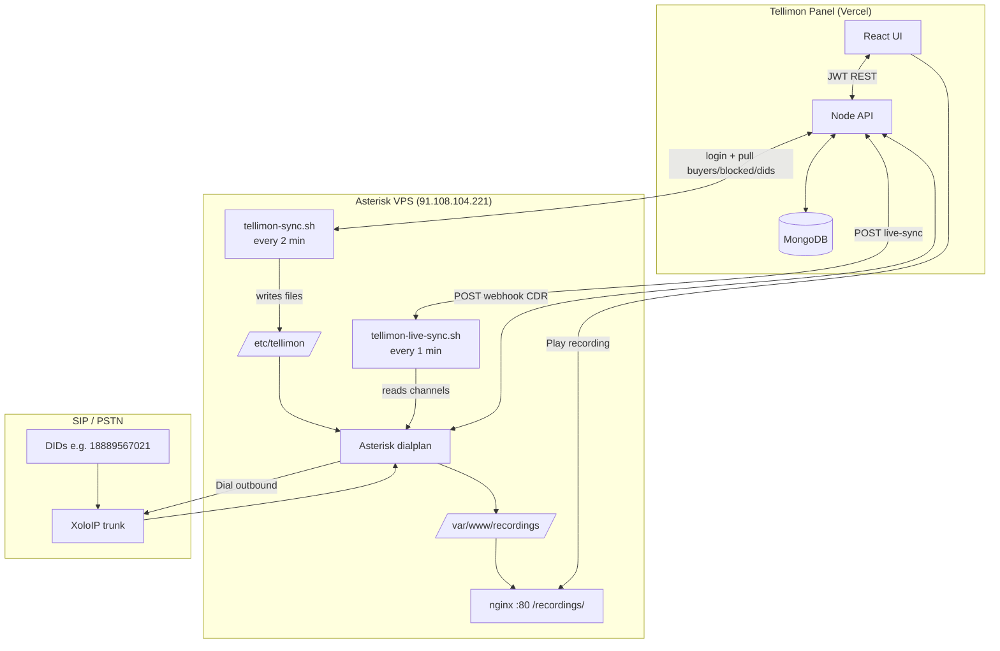
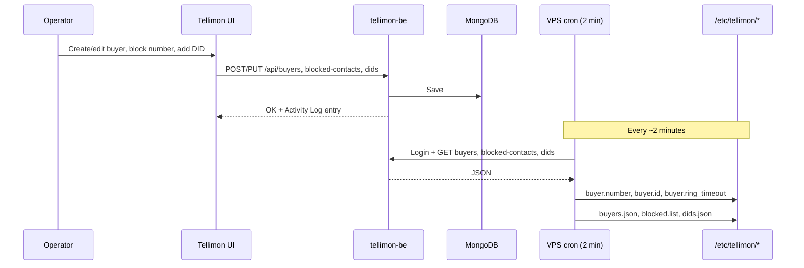
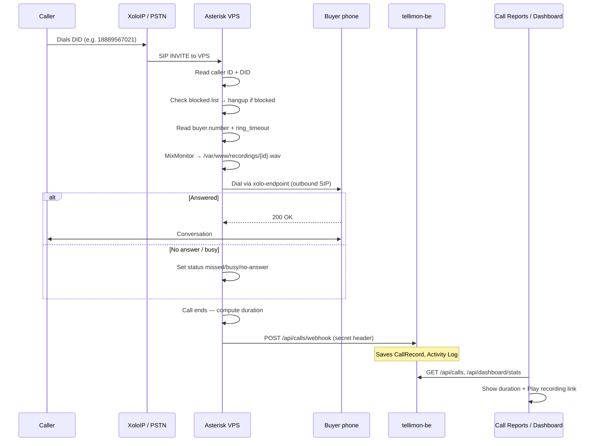
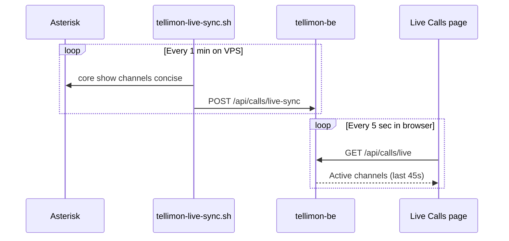
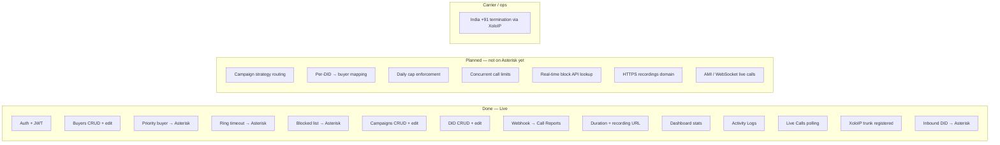

# Tellimon — Features & How They Work

Tellimon is a **call forwarding control panel**. Operators use the web UI to configure who receives inbound calls, block bad numbers, track call history, and monitor activity. Phone calls are handled by **Asterisk** on a VPS; the panel stores settings and call data in **MongoDB** via a **Node.js API**.

---

## System overview

| Layer | Tech | URL / host |
|-------|------|------------|
| Frontend | React + Vite + Tailwind | tellimon-fe.vercel.app / hitechpbxworld.com |
| Backend API | Node.js + Express + JWT | tellimon-be.vercel.app |
| Database | MongoDB Atlas | Cloud |
| Telephony | Asterisk 20 + PJSIP (XoloIP trunk) | 91.108.104.221 |

---

## How it works — full flow

### 1. Architecture (three layers)



### 2. Operator configures the panel (panel → VPS sync)



**What syncs to Asterisk today:**

| Panel setting | Synced? | VPS file | Used on call? |
|---------------|---------|----------|---------------|
| Buyer number (highest priority **Active**) | Yes (~2 min) | `buyer.number` | Yes — who gets the call |
| Buyer ring timeout | Yes | `buyer.ring_timeout` | Yes — `Dial(..., timeout)` |
| Blocked numbers | Yes | `blocked.list` | Yes — caller rejected |
| DIDs + campaign links | Yes | `dids.json` | **No** — label only for now |
| Campaign strategy | Yes | `routing.json` | Yes — via `/api/routing/resolve` |
| Daily cap / concurrent | Yes | API (real-time) | Yes — on each call |

### 3. Inbound call flow (what happens on a real call)



**MVP routing rule (today):** every inbound DID → **one** highest-priority **Active** buyer. Campaign and per-DID buyer rules are **not** applied on Asterisk yet.

### 4. Live calls flow (while call is in progress)



### 5. What's done vs planned



| Area | Status | Notes |
|------|--------|-------|
| Panel ↔ API ↔ MongoDB | **Done** | All screens use live APIs |
| Buyer forward + ring timeout | **Done** | Synced every ~2 min |
| Blocked callers | **Done** | Synced file check in dialplan |
| Call duration in reports | **Done** | From webhook `billsec` / `duration` |
| Recording files + Play link | **Done** | HTTP on VPS; needs real call to populate |
| Campaign strategy on calls | **Planned** | Saved in DB only |
| Per-DID routing | **Planned** | DIDs synced but dialplan ignores |
| India outbound to buyer | **Blocked at carrier** | XoloIP must enable intl termination |

---

## Feature status legend

| Status | Meaning |
|--------|---------|
| **Live** | Fully wired — UI talks to API, data persists |
| **Partial** | UI + API exist, but not connected to Asterisk yet |
| **UI only** | Screen exists with mock/demo data |
| **Planned** | Designed but not built |

---

## 1. Authentication — **Live**

**What it does:** Secure login so each user only sees their own data.

**How it works:**
1. User enters email + password on `/login`
2. Frontend calls `POST /api/auth/login`
3. Backend checks MongoDB, returns JWT token
4. Token stored in browser (`localStorage`) and sent on every API request
5. Protected pages redirect to login if token is missing or expired

**Demo account:** `demo@tellimon.com` / `demo123`

**Activity logged:** Every login creates an entry in Activity Logs.

---

## 2. Dashboard — **Live**

**What it does:** Overview of campaigns, blocked contacts, and call volume (all-time).

**How it works:**
1. Page loads → `GET /api/dashboard/stats`
2. Backend counts documents in MongoDB for the logged-in user:
   - Campaigns created
   - Blocked contacts
   - Total / answered / missed calls (from Call Records)
3. **Refresh stats** button reloads from API (not a date-range filter)

---

## 3. Buyers — **Live** (Asterisk sync: **Live**)

**What it does:** Manage the phone numbers that receive forwarded inbound calls (“buyers”).

**Fields:**
| Field | Purpose |
|-------|---------|
| Name | Label for the buyer |
| Number | Phone number to ring (E.164, e.g. `+919876543210`) |
| Daily cap | Max calls per day (0 = unlimited) — **enforced on each call** |
| Priority | Used when strategy is **Priority** |
| Ring timeout | Seconds to ring before hangup — **per buyer** |
| Concurrent calls | Max simultaneous calls — **enforced live** |
| Status | **Active** = eligible for forwarding; Inactive/Paused = skipped |

**How it works today:**
1. Create / **edit** buyer → `POST` / `PUT /api/buyers` → saved in MongoDB
2. List, search, paginate, delete via API
3. Activity log entry on create/update/delete

**How it works with Asterisk:**
1. VPS sync pulls routing snapshot every 2 min (`/api/routing/snapshot`)
2. On each inbound call, `tellimon-pick-buyer.py` calls `POST /api/routing/resolve`
3. Resolver applies campaign strategy, daily cap, concurrent limits, duplicate/sticky rules
4. Dialplan forwards to selected buyer; webhook saves `buyerId` and `campaignId`

---

## 4. Campaigns — **Live**

**What it does:** Groups buyers and defines how calls are routed.

**Fields:** Name, Strategy, Duplicate handling, Active toggle, **assigned buyers**.

**How it works:**
1. Create / edit campaign → assign one or more buyers (empty = all active buyers)
2. Link DIDs to campaigns in DID Management
3. On each inbound call, Asterisk calls `POST /api/routing/resolve` with DID + caller
4. Strategy picks buyer: Priority, Round Robin, Sticky, Random
5. Duplicate handling applies for repeat callers

---

## 5. Blocked Contacts — **Live** (Asterisk sync: **~2 min delay**)

**What it does:** Block specific phone numbers from being forwarded.

**How it works today:**
1. Add number → `POST /api/blocked-contacts`
2. Search and delete in UI
3. Stored per user in MongoDB

**How it works with Asterisk (today):**
1. `tellimon-sync.sh` writes blocked numbers to `/etc/tellimon/blocked.list`
2. Dialplan `tellimon-check-blocked` rejects matching callers before forward

**Still planned:** real-time API lookup on each call (no 2-minute delay)

---

## 6. Call Reports — **Live**

**What it does:** History of all calls — duration, status, recordings.

**How it works today:**
1. Page loads → `GET /api/calls` (paginated, filterable)
2. Data appears when Asterisk (or manual curl test) POSTs to webhook

**Webhook:** `POST /api/calls/webhook`

Required headers:
```
x-asterisk-secret: YOUR_ASTERISK_WEBHOOK_SECRET
```

Required body fields:
| Field | Description |
|-------|-------------|
| `userId` | MongoDB user ID (from login response) |
| `caller` | Caller phone number |
| `did` | Inbound number that was dialed |
| `buyerNumber` | Number that was rung |
| `status` | `answered`, `missed`, `busy`, `failed`, `no-answer` |
| `duration` | Total seconds (ring + talk) |
| `billsec` | Billable talk seconds |
| `uniqueId` | Asterisk call ID (prevents duplicates) |
| `recordingUrl` | Public URL to play recording in panel |

**After save:**
- Row shows in Call Reports
- Dashboard stats update
- Activity Logs gets `call_completed` entry

**Recording playback:** User clicks play link → browser opens `recordingUrl` (served by nginx on VPS at `/recordings/`).

See also: `backend/docs/ASTERISK_CDR_RECORDING.md`

---

## 7. Activity Logs — **Live**

**What it does:** Audit trail of everything that happens in the panel.

**Logged automatically:**
| Action | Category |
|--------|----------|
| User login | auth |
| Buyer created / deleted | buyer |
| Campaign created / deleted | campaign |
| Contact blocked / unblocked | blocked |
| Call completed (webhook) | call |

**How it works:**
1. Backend `logActivity()` writes to MongoDB on each event
2. UI loads `GET /api/activity-logs` with search, category filters, pagination

---

## 8. DID Management — **Live**

**What it does:** Manage inbound phone numbers and link them to campaigns (label).

**How it works:**
1. `GET/POST/PUT/DELETE /api/dids` — CRUD in MongoDB
2. UI lists DIDs with campaign, trunk, calls-today count
3. Edit DID: campaign, optional **direct buyer**, status, trunk
4. Optional `buyerId` bypasses campaign strategy for that number

---

## 9. Live Calls — **Live** (polling)

**What it does:** View calls currently in progress on Asterisk.

**How it works:**
1. VPS cron runs `/usr/local/bin/tellimon-live-sync.sh` every minute
2. Parses `asterisk -rx 'core show channels concise'` and POSTs to `/api/calls/live-sync`
3. UI polls `GET /api/calls/live` every 5 seconds

**Still planned:** AMI/WebSocket for sub-second updates, hangup/transfer actions

---

## 10. Layout & UX — **Live**

| Feature | Status |
|---------|--------|
| Golden/black theme | Live |
| Responsive sidebar + mobile menu | Live |
| SPA routing (`vercel.json` rewrites) | Live |
| JWT session persistence | Live |

**Removed:** Billing section, theme palette picker.

---

## Quick reference — one inbound call

```
1. Caller dials DID (XoloIP → Asterisk 91.108.104.221)
2. Dialplan: blocked? → hangup | else read buyer.number + ring_timeout
3. MixMonitor records → /var/www/recordings/{UNIQUEID}.wav
4. Dial(PJSIP/buyer@xolo-endpoint, timeout)
5. Hangup → curl POST /api/calls/webhook → MongoDB
6. Panel: Call Reports (duration + Play), Dashboard counts, Activity Log
```

See **How it works — full flow** above for diagrams.

---

## API endpoints (summary)

| Method | Path | Auth | Purpose |
|--------|------|------|---------|
| POST | `/api/auth/login` | No | Login |
| GET | `/api/auth/me` | Yes | Current user |
| GET | `/api/dashboard/stats` | Yes | Dashboard counts |
| GET/POST/PUT/DELETE | `/api/buyers` | Yes | Buyer CRUD |
| GET/POST/PUT/DELETE | `/api/campaigns` | Yes | Campaign CRUD |
| GET/POST/DELETE | `/api/blocked-contacts` | Yes | Block list CRUD |
| GET/POST/PUT/DELETE | `/api/dids` | Yes | DID CRUD + campaign link |
| GET | `/api/calls` | Yes | Call reports list |
| GET | `/api/calls/stats` | Yes | Call aggregates |
| GET | `/api/calls/live` | Yes | Active calls (polling) |
| POST | `/api/calls/webhook` | Secret header | Asterisk CDR ingest |
| POST | `/api/calls/live-sync` | Secret header | Asterisk active channel sync |
| GET | `/api/routing/snapshot` | Yes | Full routing bundle for VPS sync |
| POST | `/api/routing/resolve` | Secret header | Pick buyer for inbound call |
| GET | `/api/health` | No | Health check |

---

## Environment variables

### Backend (Vercel — tellimon-be)

| Variable | Purpose |
|----------|---------|
| `MONGODB_URI` | MongoDB Atlas connection |
| `JWT_SECRET` | Token signing |
| `CLIENT_URL` | Comma-separated frontend URLs for CORS |
| `ASTERISK_WEBHOOK_SECRET` | Validates webhook from Asterisk |

### Frontend

API URL hardcoded in `src/api/client.js` → `https://tellimon-be.vercel.app/api`

### Asterisk VPS

| Item | Purpose |
|------|---------|
| `/etc/asterisk/pjsip.d/xoloip.conf` | XoloIP PJSIP trunk (reg `xolo-reg16`) |
| `/etc/asterisk/modules.conf` | `noload => res_resolver_unbound.so` (top of `[modules]`) — **required** |
| `/etc/asterisk/extensions.d/tellimon.conf` | Inbound dialplan + webhook |
| `/etc/tellimon/config` | API URL, user ID, demo creds for sync |
| `/usr/local/bin/tellimon-sync.sh` | Pulls buyers, blocked list, DIDs from panel |
| `/usr/local/bin/tellimon-live-sync.sh` | Pushes active channels to API |
| `/var/www/recordings/` | Call recordings (nginx serves at `/recordings/`) |

Re-run setup: `scripts/vps-tellimon-setup.sh` (from repo, via SSH).

---

## Roadmap (what’s next)

| Priority | Feature | Status |
|----------|---------|--------|
| 1 | Asterisk SIP trunk registered on VPS | **Done** |
| 2 | Webhook → Call Reports end-to-end | **Done** |
| 3 | Buyer sync from panel → Asterisk | **Done** |
| 4 | Blocked caller check in dialplan | **Done** |
| 5 | Inbound DID → Asterisk → forward | **Done** (India outbound needs XoloIP intl enable) |
| 6 | Edit buyer in UI + API | **Done** (deploy backend) |
| 7 | DID Management backend + UI | **Done** (deploy backend) |
| 8 | Live Calls polling | **Done** (deploy backend for live-sync endpoint) |
| 9 | Campaign routing strategies in Asterisk | **Done** |
| 10 | Per-DID buyer override | **Done** |
| 11 | Daily cap / concurrent limits enforcement | **Done** |
| 12 | HTTPS + domain for recordings | Planned |

---

## Deployments

| Service | URL |
|---------|-----|
| Frontend | https://tellimon-fe.vercel.app |
| Custom domain | https://hitechpbxworld.com |
| Backend API | https://tellimon-be.vercel.app |
| Asterisk VPS | 91.108.104.221 |

---

## For developers

- **Frontend:** `src/pages/` — one file per screen
- **Backend:** `backend/src/routes/` — one file per resource
- **Models:** `backend/src/models/` — MongoDB schemas
- **Asterisk docs:** `backend/docs/ASTERISK_CDR_RECORDING.md`

Demo login seeds automatically on backend startup if user does not exist.
